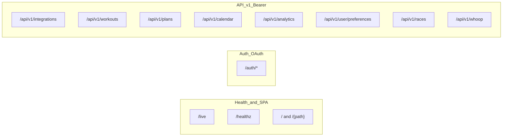

# API surface (MVP backend)

**Base URL:** whatever you deploy as the API host (e.g. Railway/Render/Cloud Run). **API version prefix:** most resources live under `/api/v1/...`.

**Auth for protected routes:** `Authorization: Bearer <JWT>` (see [`app/deps.py`](../app/deps.py) — `HTTPBearer`).

**Discovery:** FastAPI serves **`GET /openapi.json`**, **`GET /docs`** (Swagger), **`GET /redoc`** unless disabled elsewhere.

---

## Platform / health / static

| Method | Path | Notes |
|--------|------|--------|
| GET | `/live` | Liveness (no DB) |
| GET | `/healthz` | Readiness; checks DB (`SELECT 1`) |
| GET | `/health` | Legacy simple healthy response |
| GET | `/privacy` | HTML privacy policy |
| GET | `/redirect` | Post-OAuth HTML landing (links to `frontend_base_url`) |
| GET | `/` | SPA `index.html` when built |
| GET | `/{full_path:path}` | SPA catch-all (same index) |
| GET | `/assets/*` | Static assets when Vite build present |

---

## Auth and OAuth ([`app/api/auth.py`](../app/api/auth.py), mounted at **`/auth`**)

| Method | Path | Auth |
|--------|------|------|
| GET | `/auth/strava/authorize` | Starts Strava OAuth (optional `redirect_url` query; validated against allowlist) |
| GET | `/auth/strava/callback` | Strava OAuth callback |
| GET | `/auth/google/authorize` | Starts Google OAuth |
| POST | `/auth/google/authorize-url` | JSON body flow for authorize URL (SPA-friendly) |
| GET | `/auth/google/callback` | Google OAuth callback |
| GET | `/auth/whoop/authorize` | Starts Whoop OAuth |
| POST | `/auth/whoop/authorize-url` | JSON body flow for authorize URL |
| GET | `/auth/whoop/callback` | Whoop OAuth callback |
| GET | `/auth/provider-callbacks` | **Public** — returns configured redirect URIs and `frontend_base_url` / `allowed_origins` (ops/debug) |
| POST | `/auth/token/bootstrap` | **Bootstrap only** — `X-Bootstrap-Key` header; mints JWT for first DB user when `AUTH_BOOTSTRAP_KEY` is set |

---

## Integrations ([`app/api/integrations.py`](../app/api/integrations.py)) — **`/api/v1/integrations`**

| Method | Path | Auth |
|--------|------|------|
| GET | `/api/v1/integrations` | Bearer — returns `strava` / `google` / `whoop` connection flags and IDs |

---

## Workouts ([`app/api/workouts.py`](../app/api/workouts.py)) — **`/api/v1/workouts`**

| Method | Path | Auth |
|--------|------|------|
| GET | `/api/v1/workouts` | Bearer — query: `limit`, `offset`, `start_date`, `end_date` |
| POST | `/api/v1/workouts/sync` | Bearer — query: `days` (Strava sync; rate limited) |
| GET | `/api/v1/workouts/{workout_id}` | Bearer |

---

## Training plans ([`app/api/plans.py`](../app/api/plans.py)) — **`/api/v1/plans`**

| Method | Path | Auth |
|--------|------|------|
| GET | `/api/v1/plans` | Bearer — optional `status` query |
| POST | `/api/v1/plans` | Bearer |
| GET | `/api/v1/plans/active` | Bearer |
| GET | `/api/v1/plans/{plan_id}` | Bearer |
| PUT | `/api/v1/plans/{plan_id}` | Bearer |
| POST | `/api/v1/plans/{plan_id}/adjust` | Bearer |
| POST | `/api/v1/plans/ai-generate` | Bearer |

---

## Calendar ([`app/api/calendar.py`](../app/api/calendar.py)) — **`/api/v1/calendar`**

| Method | Path | Auth |
|--------|------|------|
| POST | `/api/v1/calendar/sync` | Bearer — `plan_id` required as **query** parameter |
| GET | `/api/v1/calendar/events` | Bearer — query: `days` |

---

## Analytics ([`app/api/analytics.py`](../app/api/analytics.py)) — **`/api/v1/analytics`**

| Method | Path | Auth |
|--------|------|------|
| GET | `/api/v1/analytics/performance` | Bearer |
| GET | `/api/v1/analytics/plan-progress/{plan_id}` | Bearer |
| POST | `/api/v1/analytics/performance-check` | Bearer |

---

## User preferences ([`app/api/preferences.py`](../app/api/preferences.py)) — **`/api/v1/user`**

| Method | Path | Auth |
|--------|------|------|
| GET | `/api/v1/user/preferences` | Bearer |
| PUT | `/api/v1/user/preferences` | Bearer |

---

## Races ([`app/api/races.py`](../app/api/races.py)) — **`/api/v1/races`**

| Method | Path | Auth |
|--------|------|------|
| POST | `/api/v1/races/analyze` | **No Bearer** — query: `url`, optional `race_date` |

---

## Whoop ([`app/api/whoop.py`](../app/api/whoop.py)) — **`/api/v1/whoop`**

| Method | Path | Auth |
|--------|------|------|
| GET | `/api/v1/whoop/recovery` | Bearer |
| GET | `/api/v1/whoop/recovery/trend` | Bearer — query: `days` (capped at 30 server-side) |
| POST | `/api/v1/whoop/webhook/register` | **No Bearer** — registers callback with Whoop when `WHOOP_*` credentials are configured (server-side / ops) |
| POST | `/api/v1/whoop/webhook` | **Whoop webhook** — `X-Whoop-Signature` header (HMAC); not a Bearer token |

---

## Mermaid: high-level grouping

---

**For Lovable / frontends:** Point the app at your deployed API origin; use **`/openapi.json`** or **`/docs`** for exact request/response schemas. Protected UI flows should attach the JWT from your session (after OAuth callback or bootstrap) on **`/api/v1/*`** calls. OAuth redirect URIs must match what the backend exposes via **`GET /auth/provider-callbacks`** and your provider app settings.
